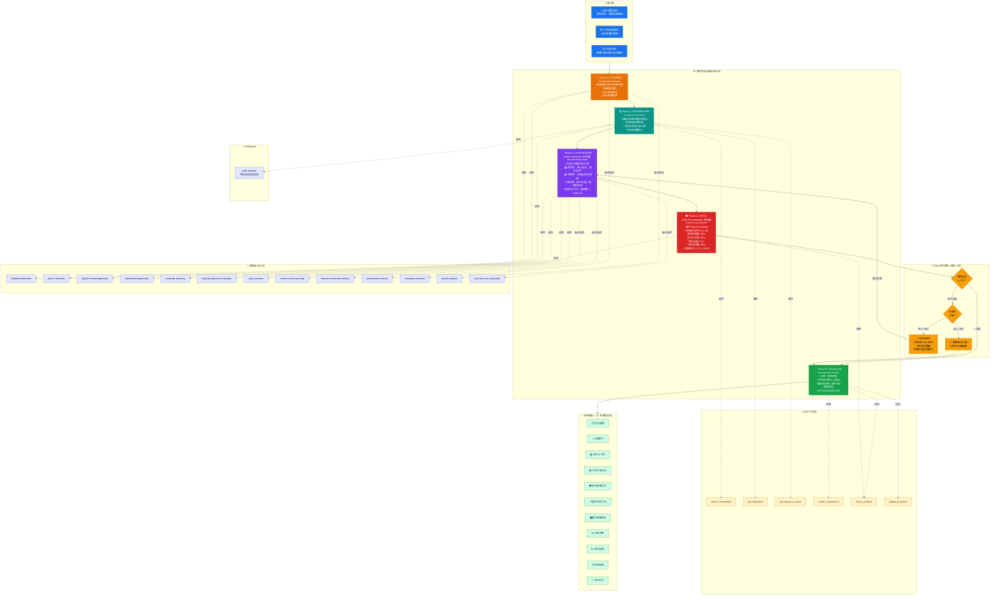
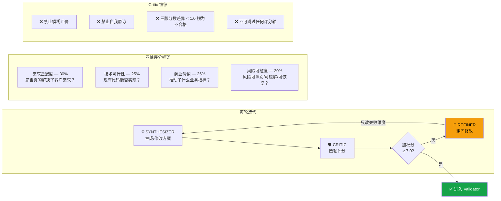
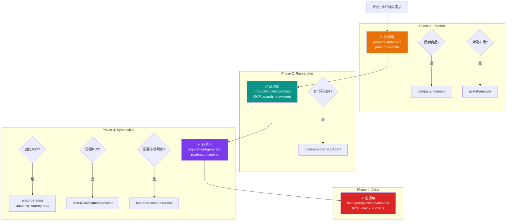
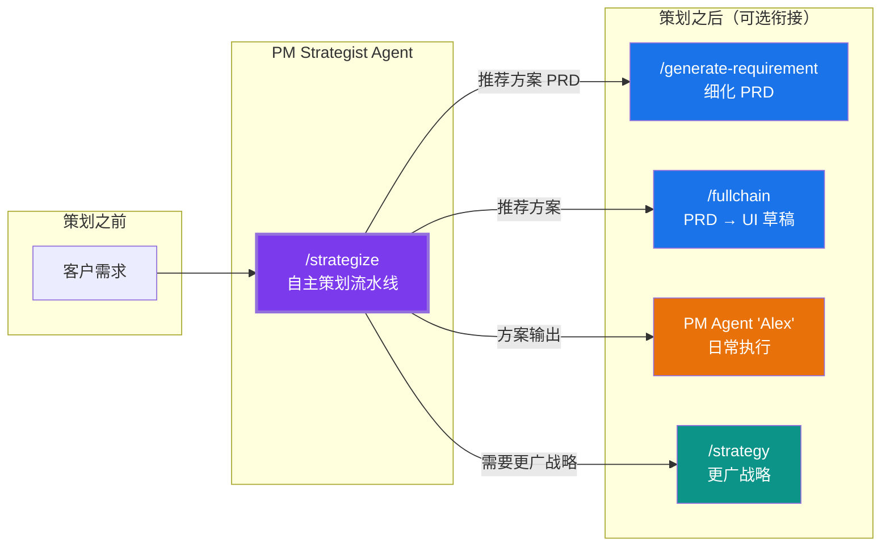

# PM Strategist Agent — 架构设计图

## 整体架构

```mermaid
flowchart TB
    subgraph Input["🎯 输入层"]
        direction LR
        U["👤 客户需求描述<br/><i>自然语言，任意详细程度</i>"]
        R["📦 代码仓库路径<br/><i>可选但强烈推荐</i>"]
        C["📋 已知约束<br/><i>预算/时间/团队/技术限制</i>"]
    end

    subgraph Pipeline["⚙️ 五角色自主推演流水线"]
        P["🧠 Phase 1: PLANNER<br/>━━━━━━━━━━━━━━<br/>• 提取目标/用户/场景/约束<br/>• 构建假设树<br/>• 定义成功标准<br/>• 划定范围边界"]

        RE["🔍 Phase 2: RESEARCHER<br/>━━━━━━━━━━━━━━<br/>• 读取仓库结构/模块/接口<br/>• 检索知识库文档<br/>• 分析技术能力与约束<br/>• 标注信息缺口"]

        S["💡 Phase 3: SYNTHESIZER<br/><i>(GAN Generator 生成器)</i><br/>━━━━━━━━━━━━━━<br/>• 生成三版差异化方案<br/>  🟢 保守版：最小改动，最大复用<br/>  🟡 平衡版：创新与稳定兼顾<br/>  🔴 激进版：最大价值，接受高风险<br/>• 每版含 PRD + 路线图 + Trade-off"]

        CR["🛡️ Phase 4: CRITIC<br/><i>(GAN Discriminator 批判器)</i><br/>━━━━━━━━━━━━━━<br/>• 建立 Sprint Contract<br/>• 四轴独立评分 (1-10)<br/>  需求匹配度 30%<br/>  技术可行性 25%<br/>  商业价值 25%<br/>  风险可控度 20%<br/>• 加权总分 ≥ 7.0 = PASS"]

        V["✅ Phase 5: VALIDATOR<br/>━━━━━━━━━━━━━━<br/>• 8 项一致性校验<br/>• 代码可行性二次确认<br/>• 置信度评估 (高/中/低)<br/>• 最终判定: APPROVED/REVISE"]
    end

    subgraph GAN["🔄 GAN 迭代循环 (最多 4 轮)"]
        D{"加权总分<br/>≥ 7.0 ?"}
        RF["🔧 REFINER<br/>只修改 Critic 标记<br/>为失败的维度<br/>保留已通过的部分"]
        MAX{"已迭代<br/>4 轮?"}
        BEST["📌 取最高分方案<br/>+ 附加'已知局限'"]
    end

    subgraph Skills["🧩 可插拔 Skill 池"]
        direction TB
        SK1["problem-statement"]
        SK2["jobs-to-be-done"]
        SK3["product-knowledge-base"]
        SK4["requirement-generator"]
        SK5["roadmap-planning"]
        SK6["multi-perspective-evaluation"]
        SK7["proto-persona"]
        SK8["customer-journey-map"]
        SK9["feature-investment-advisor"]
        SK10["prioritization-advisor"]
        SK11["company-research"]
        SK12["pestel-analysis"]
        SK13["tam-sam-som-calculator"]
    end

    subgraph MCP["🔌 MCP 工具层"]
        direction TB
        M1["search_knowledge"]
        M2["get_templates"]
        M3["get_progress_board"]
        M4["create_requirement"]
        M5["check_conflicts"]
        M6["update_progress"]
    end

    subgraph SubAgent["🤖 SubAgent"]
        CE["code-explorer<br/>代码仓库自动分析"]
    end

    subgraph Output["📄 最终输出（11 节完整文档）"]
        direction LR
        O1["📋 执行摘要"]
        O2["🎯 问题定义"]
        O3["💻 技术上下文"]
        O4["📊 三版方案对比"]
        O5["🛡️ 批判审查记录"]
        O6["📝 推荐方案 PRD"]
        O7["🗺️ 实施路线图"]
        O8["⚠️ 风险清单"]
        O9["📈 成功指标"]
        O10["❓ 已知局限"]
        O11["📖 迭代日志"]
    end

    %% 主流程
    Input --> P
    P --> RE
    RE --> S
    S --> CR
    CR --> D

    %% GAN 循环
    D -->|"❌ 不通过"| MAX
    MAX -->|"否 (< 4轮)"| RF
    RF -->|"重写方案"| S
    MAX -->|"是 (= 4轮)"| BEST
    BEST --> V
    D -->|"✅ 通过"| V

    %% 输出
    V --> Output

    %% Skill 调用关系
    P -.->|"调用"| SK1 & SK2
    P -.->|"条件调用"| SK11 & SK12
    RE -.->|"调用"| SK3
    RE -.->|"调用"| CE
    S -.->|"调用"| SK4 & SK5 & SK7 & SK8
    S -.->|"条件调用"| SK9 & SK10 & SK13
    CR -.->|"调用"| SK6

    %% MCP 调用关系
    RE -.->|"调用"| M1 & M2 & M3
    CR -.->|"调用"| M5
    V -.->|"调用"| M5
    V -.->|"存储"| M4 & M6

    %% 样式
    classDef inputStyle fill:#1a73e8,stroke:#1557b0,color:#fff
    classDef plannerStyle fill:#e8710a,stroke:#c45d08,color:#fff
    classDef researcherStyle fill:#0d9488,stroke:#0a7a70,color:#fff
    classDef synthStyle fill:#7c3aed,stroke:#6429c9,color:#fff
    classDef criticStyle fill:#dc2626,stroke:#b91c1c,color:#fff
    classDef validStyle fill:#16a34a,stroke:#128a3e,color:#fff
    classDef ganStyle fill:#f59e0b,stroke:#d97706,color:#000
    classDef skillStyle fill:#e0e7ff,stroke:#6366f1,color:#1e1b4b
    classDef mcpStyle fill:#fef3c7,stroke:#d97706,color:#78350f
    classDef outputStyle fill:#d1fae5,stroke:#16a34a,color:#064e3b

    class U,R,C inputStyle
    class P plannerStyle
    class RE researcherStyle
    class S synthStyle
    class CR criticStyle
    class V validStyle
    class D,RF,MAX,BEST ganStyle
    class SK1,SK2,SK3,SK4,SK5,SK6,SK7,SK8,SK9,SK10,SK11,SK12,SK13 skillStyle
    class M1,M2,M3,M4,M5,M6 mcpStyle
    class CE skillStyle
    class O1,O2,O3,O4,O5,O6,O7,O8,O9,O10,O11 outputStyle
```

## GAN 迭代循环详图

```mermaid
flowchart LR
    subgraph Round["每轮迭代"]
        direction TB
        GEN["💡 SYNTHESIZER<br/>生成/修改方案"]
        EVAL["🛡️ CRITIC<br/>四轴评分"]
        SCORE{"加权分<br/>≥ 7.0?"}
        REF["🔧 REFINER<br/>定向修改"]

        GEN --> EVAL --> SCORE
        SCORE -->|"否"| REF -->|"只改失败维度"| GEN
    end

    SCORE -->|"是"| PASS["✅ 进入 Validator"]
    
    subgraph Scoring["四轴评分框架"]
        direction TB
        A1["需求匹配度 — 30%<br/>是否真的解决了客户需求？"]
        A2["技术可行性 — 25%<br/>现有代码能否实现？"]
        A3["商业价值 — 25%<br/>推动了什么业务指标？"]
        A4["风险可控度 — 20%<br/>风险可识别/可缓解/可恢复？"]
    end

    subgraph Rules["Critic 铁律"]
        direction TB
        R1["❌ 禁止模糊评价"]
        R2["❌ 禁止自我原谅"]
        R3["❌ 三版分数差异 < 1.0 视为不合格"]
        R4["❌ 不可跳过任何评分轴"]
    end

    style PASS fill:#16a34a,color:#fff
    style REF fill:#f59e0b,color:#000
```

## Skill 自主调度决策矩阵

```mermaid
flowchart TD
    START["开始: 用户输入需求"] --> P_ALWAYS
    
    subgraph Planner["Phase 1: Planner"]
        P_ALWAYS["✅ 必调用<br/>problem-statement<br/>jobs-to-be-done"]
        P_COMP{"提到竞品?"}
        P_MKT{"涉及市场?"}
        P_COMP -->|"是"| P_COMP_SK["company-research"]
        P_MKT -->|"是"| P_MKT_SK["pestel-analysis"]
    end

    P_ALWAYS --> R_ALWAYS

    subgraph Researcher["Phase 2: Researcher"]
        R_ALWAYS["✅ 必调用<br/>product-knowledge-base<br/>MCP: search_knowledge"]
        R_CODE{"有代码仓库?"}
        R_CODE -->|"是"| R_CODE_SK["code-explorer SubAgent"]
    end

    R_ALWAYS --> S_ALWAYS

    subgraph Synthesizer["Phase 3: Synthesizer"]
        S_ALWAYS["✅ 必调用<br/>requirement-generator<br/>roadmap-planning"]
        S_USER{"面向用户?"}
        S_ROI{"需要ROI?"}
        S_SIZE{"需要市场规模?"}
        S_USER -->|"是"| S_USER_SK["proto-persona<br/>customer-journey-map"]
        S_ROI -->|"是"| S_ROI_SK["feature-investment-advisor"]
        S_SIZE -->|"是"| S_SIZE_SK["tam-sam-som-calculator"]
    end

    S_ALWAYS --> C_ALWAYS

    subgraph Critic["Phase 4: Critic"]
        C_ALWAYS["✅ 必调用<br/>multi-perspective-evaluation<br/>MCP: check_conflicts"]
    end

    style P_ALWAYS fill:#e8710a,color:#fff
    style R_ALWAYS fill:#0d9488,color:#fff
    style S_ALWAYS fill:#7c3aed,color:#fff
    style C_ALWAYS fill:#dc2626,color:#fff
```

## 与现有系统的关系

```mermaid
flowchart LR
    subgraph Before["策划之前"]
        NEED["客户需求"]
    end

    subgraph PMStrategist["PM Strategist Agent"]
        STRAT["/strategize<br/>自主策划流水线"]
    end

    subgraph After["策划之后（可选衔接）"]
        GR["/generate-requirement<br/>细化 PRD"]
        FC["/fullchain<br/>PRD → UI 草稿"]
        ALEX["PM Agent 'Alex'<br/>日常执行"]
        SR["/strategy<br/>更广战略"]
    end

    NEED --> STRAT
    STRAT -->|"推荐方案 PRD"| GR
    STRAT -->|"推荐方案"| FC
    STRAT -->|"方案输出"| ALEX
    STRAT -->|"需要更广战略"| SR

    style STRAT fill:#7c3aed,color:#fff,stroke-width:3px
    style GR fill:#1a73e8,color:#fff
    style FC fill:#1a73e8,color:#fff
    style ALEX fill:#e8710a,color:#fff
    style SR fill:#0d9488,color:#fff
```
